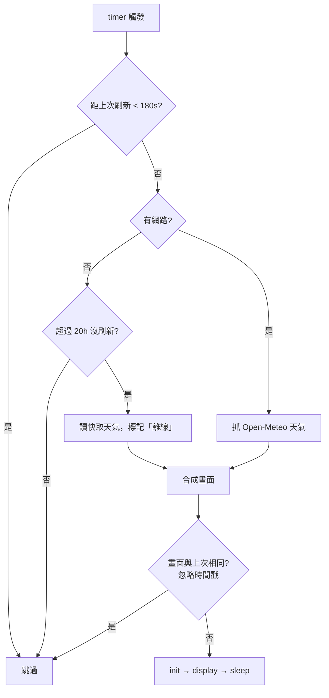
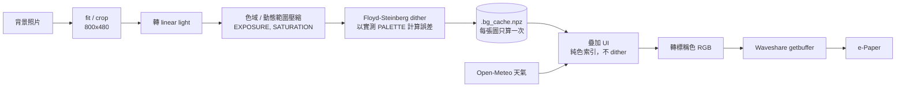

> &nbsp;
> ### <div style="text-align: right"> <font color="#02c59b">E-Paper Photo Frame</font> </div>
> ### <div style="text-align: right"> <font color="#ffcc00">Spectra 6 (E6) Full-Color e-Paper Weather Dashboard on Raspberry Pi 3</font></div>
>
> <div style="text-align: right"> Version: 1.0.0 </div>
> <div style="text-align: right"> Author: J </div>
> <div style="text-align: right"> Date: 2026/09/21 </div>

File History :
|         Type         |                         Description                          | Name |    Date    |
| :------------------: | :----------------------------------------------------------: | :--: | :--------: |
| v1.0.0 first release | 7.3" E6 (epd7in3e) photo frame + weather dashboard + hourly update | J | 2026/09/21 |

<div style="page-break-after: always;"></div>

# Table of contents
- [Table of contents](#table-of-contents)
- [Test Environment](#test-environment)
- [0. 專案簡介 Overview](#0-專案簡介-overview)
- [1. 硬體 Hardware](#1-硬體-hardware)
  - [1.1. 面板規格 Panel specification](#11-面板規格-panel-specification)
  - [1.2. 接線 Wiring](#12-接線-wiring)
- [2. 系統設定 Raspberry Pi setup](#2-系統設定-raspberry-pi-setup)
- [3. 安裝本專案 Install this project](#3-安裝本專案-install-this-project)
- [4. 設定 Configuration](#4-設定-configuration)
- [5. 使用方式 Usage](#5-使用方式-usage)
- [6. 顏色校正 Color calibration](#6-顏色校正-color-calibration)
- [7. 開機與每小時自動更新 Auto update with systemd](#7-開機與每小時自動更新-auto-update-with-systemd)
- [8. 運作原理 How it works](#8-運作原理-how-it-works)
- [9. 成果 Result](#9-成果-result)
- [10. 注意事項 Precautions](#10-注意事項-precautions)
- [11. 疑難排解 Troubleshooting](#11-疑難排解-troubleshooting)
- [12. 更換面板 Porting to another panel](#12-更換面板-porting-to-another-panel)
- [13. 參考資料 References](#13-參考資料-references)

# Test Environment

| Item        | Version / Model                                   | Comments                                   |
| ----------- | ------------------------------------------------- | ------------------------------------------ |
| Board       | Raspberry Pi 3 Model B V1.2                       | 3B / 3B+ 同樣適用                           |
| OS          | Raspberry Pi OS                                   | Python 3.13                                |
| e-Paper     | Waveshare 7.3inch e-Paper HAT (E)                 | E Ink Spectra 6 (E6), 800 × 480            |
| Driver      | waveshare/e-Paper `epd7in3e`                      | `RaspberryPi_JetsonNano/python/lib`        |
| Python libs | python3-pil, python3-numpy, spidev, gpiozero      | 皆由 apt 安裝                               |
| Font        | fonts-noto-cjk                                    | 中文字型                                    |
| Weather API | [Open-Meteo](https://open-meteo.com/)             | 免 API key                                 |

# 0. 專案簡介 Overview

把 Waveshare 7.3 吋 Spectra 6 六色電子紙接上 Raspberry Pi 3，做成一個「照片 + 天氣」的電子相框：

- 背景是自己的照片，每天自動換一張（或指定某一張）
- 照片上疊加目前溫度、體感、濕度、風速、降雨機率與未來四天預報
- 開機連上網路後更新一次，之後每小時整點更新
- 沒網路就不刷新；但超過 20 小時沒刷新會用快取資料強制刷一次（面板規格要求 24 小時內至少刷一次）
- 畫面內容沒變（只差時間戳）就跳過刷新，減少閃爍與面板耗損

三支腳本：

| Script            | 用途                                                             |
| ----------------- | ---------------------------------------------------------------- |
| `epaper_photo.py` | 影像處理 pipeline（色域壓縮 + dither）、面板設定、單張照片顯示、顏色校正 |
| `dashboard.py`    | 天氣看板主程式：抓天氣、疊加文字圖示、刷新面板                         |
| `recover.py`      | 面板診斷（全黑測試）與殘影救援（黑白 / 六色交替全刷）                   |

# 1. 硬體 Hardware

### 1.1. 面板規格 Panel specification

| Item                 | Spec                                   |
| -------------------- | -------------------------------------- |
| Resolution           | 800 × 480                              |
| Display area         | 160.0 mm × 96.0 mm                     |
| Dot pitch            | 0.2 mm（約 127 ppi）                    |
| Colors               | E6：黑、白、黃、紅、藍、綠                |
| Full refresh time    | 約 25 s（刷新過程會閃爍，屬正常現象）       |
| Interface            | SPI (mode 0)                           |
| Operating voltage    | 3.3 V / 5 V                            |
| Operating temp.      | 0 ~ 50 ℃                               |

### 1.2. 接線 Wiring

驅動板可以直接插在 Pi 的 40PIN 排針上，或用附的 8PIN 線連接。用 8PIN 線時對照下表：

| e-Paper | BCM   | Board pin |
| :-----: | :---: | :-------: |
| VCC     | 3.3V  | 3.3V      |
| GND     | GND   | GND       |
| DIN     | MOSI  | 19        |
| CLK     | SCLK  | 23        |
| CS      | CE0   | 24        |
| DC      | 25    | 22        |
| RST     | 17    | 11        |
| BUSY    | 24    | 18        |

> Raspberry Pi pinout（來源：Waveshare Wiki）
>
> 

> 實際接線：8PIN 線連接 7.3inch e-Paper HAT (E) 與 Raspberry Pi 3 Model B
>
> 

接線要點：

- 驅動板上的 **SPI Select 開關撥到 `0`（4-line SPI）**
- 8PIN 延長線不要超過 20 cm，太長可能造成資料遺失、畫面偏移
- 面板的 FPC 排線很脆弱：**只能沿螢幕水平方向彎**，不要垂直折、不要往螢幕正面折、不要反覆彎。FPC 連接器是 0.5 mm pitch 後掀式，插拔前先把壓條掀起，完全斷電再操作

# 2. 系統設定 Raspberry Pi setup

**Step 1. 開啟 SPI**

```shell
$ sudo raspi-config
# Interface Options -> SPI -> Yes
$ sudo reboot
$ ls /dev/spi*        # 應看到 /dev/spidev0.0 /dev/spidev0.1
```

**Step 2. 安裝套件**

```shell
$ sudo apt update
$ sudo apt install python3-pip python3-pil python3-numpy python3-spidev python3-gpiozero fonts-noto-cjk
```

**Step 3. 使用者群組（不需要 sudo 執行）**

一般使用者只要在 `spi`、`gpio` 群組就能驅動面板。本專案的腳本**一律不要用 sudo 執行**（見 [11. 疑難排解](#11-疑難排解-troubleshooting)）。

```shell
$ id                                  # 確認有 spi、gpio
$ sudo usermod -aG spi,gpio $USER     # 若沒有，加入後重新登入
```

**Step 4. 下載 Waveshare 官方驅動並先跑官方範例**

先確認硬體與接線沒問題，再跑本專案：

```shell
$ mkdir -p ~/workspace && cd ~/workspace
$ git clone https://github.com/waveshare/e-Paper.git
$ cd e-Paper/RaspberryPi_JetsonNano/python/examples
$ python3 epd_7in3e_test.py
```

官方範例能正常顯示六色圖形與範例圖片，才進行下一步。

# 3. 安裝本專案 Install this project

目錄結構：

```
~/epaper/
├── epaper_photo.py
├── dashboard.py
├── recover.py
├── lib -> ~/workspace/e-Paper/RaspberryPi_JetsonNano/python/lib   (symlink)
├── bg/                      # 背景照片，放 jpg / png / bmp
├── systemd/
│   ├── epaper-dash.service
│   └── epaper-dash.timer
└── img/                     # README 用圖
```

```shell
$ mkdir -p ~/epaper/bg && cd ~/epaper
# 放入三支 .py 與 systemd/

# 把 Waveshare 的 python lib 接進來（注意是 python/lib 這層，不是 waveshare_epd）
$ ln -s ~/workspace/e-Paper/RaspberryPi_JetsonNano/python/lib ~/epaper/lib
$ ls ~/epaper/lib/waveshare_epd/epd7in3e.py      # 能列出檔案才代表連結正確

# 放幾張背景照片
$ cp ~/Pictures/*.jpg ~/epaper/bg/
```

> 如果 `~/epaper/lib` 已經是一個存在的目錄，`ln -s` 會在裡面建出 `lib/lib`，import 仍然失敗。先 `rm` 掉再建。

# 4. 設定 Configuration

**`epaper_photo.py`：面板與影像處理**

| 參數             | 預設                | 說明                                                   |
| ---------------- | ------------------- | ------------------------------------------------------ |
| `DRIVER`         | `"epd7in3e"`        | Waveshare 驅動模組名稱                                  |
| `W, H`           | `800, 480`          | 面板解析度                                              |
| `PALETTE_SRGB`   | 估計值               | 面板實測六原色，**務必校正**（見第 6 節）                   |
| `EXPOSURE`       | `1.25`              | >1 提亮中間調；照片偏暗就往上調                             |
| `SATURATION`     | `1.25`              | 飽和度預補償（dither 會讓顏色變淡）                         |
| `LOCAL_AMOUNT`   | `0.55`              | 局部對比（unsharp），0 關閉                                |

**`dashboard.py`：看板內容與刷新策略**

| 參數              | 預設                    | 說明                                             |
| ----------------- | ----------------------- | ------------------------------------------------ |
| `LAT, LON`        | `24.8138, 120.9675`     | 天氣查詢座標                                       |
| `PLACE`           | `"新竹"`                | 畫面上顯示的地名                                    |
| `TZ`              | `"Asia/Taipei"`         | 時區                                              |
| `SCRIM`           | `0.0`                   | 背景壓暗程度。0 = 照片原樣；文字靠黑色描邊維持可讀性       |
| `SCRIM_BANDS`     | `False`                 | 額外壓暗上下兩條 UI 區域                             |
| `MIN_INTERVAL`    | `180`                   | 最短刷新間隔（秒），面板規格要求                        |
| `MAX_AGE`         | `20 * 3600`             | 超過此時間沒刷新就強制刷新（面板規格要求 < 24 h）         |

# 5. 使用方式 Usage

> 所有指令都以一般使用者執行，**不加 sudo**。

**天氣看板 `dashboard.py`**

```shell
$ cd ~/epaper
$ python3 dashboard.py                              # 正常更新（受刷新保護規則約束）
$ python3 dashboard.py --force                      # 略過所有保護規則，立即刷新
$ python3 dashboard.py --bg bg/a.jpg --force        # 指定背景照片（不走每日輪替）
$ python3 dashboard.py --preview /tmp/p.png         # 只輸出 PNG，不碰面板
```

> ⚠️ `--preview` 的參數是**輸出**路徑。不要寫成 `bg/` 裡的來源檔，程式會拒絕寫入 `bg/`。

**單張照片 `epaper_photo.py`（不疊加天氣）**

```shell
$ python3 epaper_photo.py bg/a.jpg
$ python3 epaper_photo.py bg/a.jpg --preview /tmp/p.png
```

這支沒有 UI 遮擋，是調 `EXPOSURE`、驗證顏色校正最乾淨的工具。

**面板診斷與救援 `recover.py`**

```shell
$ python3 recover.py --black       # 全黑一次，用來判斷條紋是殘影還是硬體損傷
$ python3 recover.py               # 黑白交替 8 輪（約 1 小時，每次間隔 185 s）
$ python3 recover.py --colours     # 先刷紅綠藍黃再黑白交替（效果較強）
```

**建議的調整流程**：先用 `--preview` 在 PNG 上把版面與亮度調好，確認滿意才上實機，避免為了試參數反覆刷新面板。

# 6. 顏色校正 Color calibration

E6 面板的實際原色比標稱色暗、飽和度低得多，而且**不同批次會有色差**。dither 若拿標稱色（純 0 / 255）計算誤差，結果會又髒又暗。每片面板都應該量一次：

```shell
$ python3 epaper_photo.py --calib
```

1. 面板會顯示六個純色色塊（黑、白、黃、紅、藍、綠）
2. 在白光（日光）下**正面**拍照，避免反光
3. 用影像軟體取每個色塊中央的 RGB 平均值
4. 填回 `epaper_photo.py` 的 `PALETTE_SRGB`（順序：black, white, yellow, red, blue, green）
5. 清掉背景快取後重跑

```shell
$ rm -f .bg_cache.npz .frame_sig
$ python3 dashboard.py --force
```

# 7. 開機與每小時自動更新 Auto update with systemd

`systemd/epaper-dash.service`（`User`、路徑請改成自己的帳號）

```ini
[Unit]
Description=e-Paper weather dashboard
Wants=network-online.target
After=network-online.target

[Service]
Type=oneshot
User=ej
WorkingDirectory=/home/ej/epaper
ExecStart=/usr/bin/python3 /home/ej/epaper/dashboard.py
```

`systemd/epaper-dash.timer`

```ini
[Unit]
Description=Refresh e-Paper dashboard hourly and at boot

[Timer]
OnBootSec=2min
OnCalendar=*-*-* *:00:00
Persistent=true
RandomizedDelaySec=30

[Install]
WantedBy=timers.target
```

| 設定                  | 作用                                           |
| --------------------- | ---------------------------------------------- |
| `OnBootSec=2min`      | 開機、連上網路後更新一次                           |
| `OnCalendar=*:00:00`  | 每小時整點更新                                    |
| `Persistent=true`     | 錯過的排程（例如關機期間）開機後補跑                  |
| `RandomizedDelaySec`  | 避免整點瞬間同時觸發                               |

安裝與確認：

```shell
$ sudo cp ~/epaper/systemd/epaper-dash.* /etc/systemd/system/
$ sudo systemctl daemon-reload
$ sudo systemctl enable --now epaper-dash.timer
$ systemctl list-timers epaper-dash.timer
$ journalctl -u epaper-dash.service -n 50 --no-pager
```

每次執行時 `dashboard.py` 依序判斷：



# 8. 運作原理 How it works



幾個關鍵設計：

- **照片 dither、UI 不 dither。** 文字與圖示在 dither **之後**才以純色索引寫入，所以中文小字不會被誤差擴散打成雜點。文字一律白字加黑色描邊，放在任何亮度的照片上都讀得到。
- **用實測色算、用標稱色送。** dither 的誤差用面板實測的 `PALETTE_SRGB` 計算，輸出時再換成標稱色（純 0 / 255）交給 Waveshare 的 `getbuffer()`。因為影像裡只剩那六個精確顏色，`getbuffer()` 的最近色比對是一對一無損的，旋轉與 4bpp 打包、各尺寸面板不同的色碼都交給官方驅動處理。
- **在 linear light 做 dither。** 直接在 sRGB 值域做誤差擴散，中間調會偏暗、漸層會結塊。
- **背景快取。** 照片一天才換一次，dither 結果存成 `.bg_cache.npz`，每小時的更新只重畫文字層。

# 9. 成果 Result

> 實機效果：照片背景 + 天氣資訊
>
> 

> 實機效果：夜空照片背景
>
> 

> 刷新過程（4 倍速）。E6 全刷約 25 秒，過程中的閃爍是清除殘影的正常現象
>
> 

# 10. 注意事項 Precautions

以下多數來自 Waveshare 官方說明，其中幾條是本專案實際踩過、讓一片 4 吋面板報廢的教訓：

1. **刷新後一定要進 sleep 或斷電。** 面板長時間維持在高壓狀態會造成無法修復的損傷。本專案每次刷新後都會呼叫 `epd.sleep()`。
2. **刷新間隔至少 180 秒。** 除錯時不要用 `--force` 連續刷新；先用 `--preview` 在 PNG 上驗證。
3. **至少每 24 小時刷新一次**，否則長時間停留同一畫面會產生難以修復的殘影。
4. **長期不用前先刷白再收。** 儲存條件：30 ℃ 以下、55 %RH 以下、最長 6 個月，面朝上存放。台灣濕度高，超過這個期限的面板有報廢風險。
5. **FPC 排線只能沿水平方向彎**，不要垂直折、不要往正面折、不要反覆彎。
6. 低溫下刷新可能偏色，需在 25 ℃ 環境放置 6 小時後再刷新。
7. 僅建議室內使用，避免陽光直射。
8. 多色面板不同批次有色差屬正常現象，所以每片都要做[顏色校正](#6-顏色校正-color-calibration)。

# 11. 疑難排解 Troubleshooting

| 症狀                                                         | 原因                                                                  | 解法                                                                      |
| ------------------------------------------------------------ | --------------------------------------------------------------------- | ------------------------------------------------------------------------- |
| `ModuleNotFoundError: No module named 'waveshare_epd'`        | `lib` 符號連結不存在或已斷；或用了 sudo（root 看不到使用者的 pip --user 安裝） | 重建 `lib` 符號連結（見第 3 節），不要用 sudo                                  |
| systemd 失敗但手動執行正常                                     | service 的 `User`、路徑不對；或狀態檔擁有者不同                             | `sudo chown -R $USER:$USER ~/epaper`，檢查 `journalctl -u epaper-dash.service` |
| log 顯示 `background: None`                                  | `bg/` 不在腳本旁邊，或副檔名不符（例如 `a.bmp.txt`）                       | `ls -la ~/epaper/bg/`                                                     |
| 背景沒有換圖                                                  | 只有少量照片時每日輪替不明顯                                              | 多放幾張，或用 `--bg` 指定                                                   |
| 照片偏暗                                                      | `SCRIM` 開著、`EXPOSURE` 太低、`PALETTE_SRGB` 沒校正                      | `SCRIM=0`、調高 `EXPOSURE`、做顏色校正，之後 `rm .bg_cache.npz`               |
| 改了參數畫面沒變                                               | 背景快取仍是舊的（快取 key 只含照片路徑與 SCRIM 設定）                       | `rm -f .bg_cache.npz .frame_sig`                                          |
| 畫面旋轉 90° 並有規則條紋                                       | 繞過 `getbuffer()` 自行打包，與面板掃描方向不符                             | 使用本專案現行版本（透過 `getbuffer()` 送資料）                                  |
| 全白 / 全黑畫面上有固定位置的條紋                                 | 先跑 `recover.py --black`：全黑均勻 → 殘影；同位置有線 → 驅動線或膜層實體損傷  | 殘影跑 `recover.py --colours`；實體損傷無法修復，更換面板（驅動板可沿用）          |
| 一直卡在 `e-Paper busy`                                        | SPI 未啟用或接線錯誤                                                     | 檢查 `ls /dev/spi*`、接線、SPI Select 開關                                   |

# 12. 更換面板 Porting to another panel

面板相關設定只集中在 `epaper_photo.py` 開頭兩行，`dashboard.py` 與 `recover.py` 都從這裡讀取；版面的字級與座標依 `H / 400` 等比縮放。

```python
DRIVER = "epd7in3e"       # 4in0e -> "epd4in0e" | 7.3in E6 -> "epd7in3e"
W, H = 800, 480           # 4in0e -> 600, 400    | 7.3in E6 -> 800, 480
```

換面板後：

1. 確認 `lib/waveshare_epd/` 內有對應的驅動檔
2. 改上面兩行
3. 用 `--preview` 檢查版面
4. 重做[顏色校正](#6-顏色校正-color-calibration)
5. `rm -f .bg_cache.npz .frame_sig .last_refresh`

各面板的色碼不同不需要處理，由 `getbuffer()` 負責。

# 13. 參考資料 References

- [Waveshare 7.3inch e-Paper HAT (E) Manual](https://www.waveshare.com/wiki/7.3inch_e-Paper_HAT_(E)_Manual)
- [Waveshare 7.3inch e-Paper HAT (E) product page](https://www.waveshare.com/product/raspberry-pi/displays/e-paper/7.3inch-e-paper-hat-e.htm)
- [waveshare/e-Paper (GitHub)](https://github.com/waveshare/e-Paper)
- [E Ink Spectra 6 7.3" (EL073TF1U5)](https://www.eink.com/product/detail/EL073TF1U5)
- [Open-Meteo Weather API](https://open-meteo.com/en/docs)
