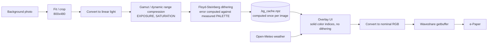

> &nbsp;
> ### <div style="text-align: right"> <font color="#02c59b">E-Paper Photo Frame</font> </div>
> ### <div style="text-align: right"> <font color="#ffcc00">Spectra 6 (E6) Full-Color e-Paper Weather Dashboard on Raspberry Pi 3</font></div>
>
> <div style="text-align: right"> Version: 1.1.0 </div>
> <div style="text-align: right"> Author: J </div>
> <div style="text-align: right"> Date: 2026/09/29 </div>

File History :
|         Type          |                         Description                          | Name |    Date    |
| :-------------------: | :----------------------------------------------------------: | :--: | :--------: |
| v1.0.0 first release  | 7.3" E6 (epd7in3e) photo frame + weather dashboard + hourly update | J | 2026/09/21 |
| v1.1.0 second release | Removed the weather icon in the top-right corner; added `--lat` / `--lon` / `--loc` arguments with input validation | J | 2026/09/29 |

<div style="page-break-after: always;"></div>

# Table of contents
- [Table of contents](#table-of-contents)
- [Test Environment](#test-environment)
- [0. Overview](#0-overview)
- [1. Hardware](#1-hardware)
  - [1.1. Panel specification](#11-panel-specification)
  - [1.2. Wiring](#12-wiring)
- [2. Raspberry Pi setup](#2-raspberry-pi-setup)
- [3. Install this project](#3-install-this-project)
- [4. Configuration](#4-configuration)
- [5. Usage](#5-usage)
- [6. Color calibration](#6-color-calibration)
- [7. Auto update with systemd](#7-auto-update-with-systemd)
- [8. How it works](#8-how-it-works)
- [9. Result](#9-result)
- [10. Precautions](#10-precautions)
- [11. Troubleshooting](#11-troubleshooting)
- [12. Porting to another panel](#12-porting-to-another-panel)
- [13. References](#13-references)

# Test Environment

| Item        | Version / Model                                   | Comments                                   |
| ----------- | ------------------------------------------------- | ------------------------------------------ |
| Board       | Raspberry Pi 3 Model B V1.2                       | Also works on 3B / 3B+                     |
| OS          | Raspberry Pi OS                                   | Python 3.13                                |
| e-Paper     | Waveshare 7.3inch e-Paper HAT (E)                 | E Ink Spectra 6 (E6), 800 × 480            |
| Driver      | waveshare/e-Paper `epd7in3e`                      | `RaspberryPi_JetsonNano/python/lib`        |
| Python libs | python3-pil, python3-numpy, spidev, gpiozero      | All installed via apt                      |
| Font        | fonts-noto-cjk                                    | CJK font                                   |
| Weather API | [Open-Meteo](https://open-meteo.com/)             | No API key required                        |

# 0. Overview

This project connects a Waveshare 7.3" Spectra 6 six-color e-Paper display to a Raspberry Pi 3 to build a "photo + weather" digital photo frame:

- The background is your own photo, which changes automatically once a day (or you can pin a specific one)
- The photo is overlaid with the current temperature, weather description, feels-like temperature, humidity, wind speed, chance of rain, and a 4-day forecast
- `--lat` / `--lon` / `--loc` let you look up a different location on the fly without affecting the scheduled defaults
- The dashboard refreshes once when the Pi boots and connects to the network, then on the hour every hour thereafter
- If there's no network, it skips the refresh — but if more than 20 hours pass without a refresh, it force-refreshes using cached data (the panel spec requires at least one refresh every 24 hours)
- If the rendered content hasn't changed (aside from the timestamp), the refresh is skipped to reduce flicker and panel wear

Three scripts:

| Script            | Purpose                                                                 |
| ----------------- | ------------------------------------------------------------------------ |
| `epaper_photo.py` | Image processing pipeline (gamut compression + dithering), panel setup, single-photo display, color calibration |
| `dashboard.py`    | The weather dashboard main program: fetches weather, overlays text/icons, refreshes the panel |
| `recover.py`      | Panel diagnostics (all-black test) and ghosting recovery (alternating black/white or six-color full refresh) |

# 1. Hardware

### 1.1. Panel specification

| Item                 | Spec                                   |
| -------------------- | --------------------------------------- |
| Resolution           | 800 × 480                              |
| Display area         | 160.0 mm × 96.0 mm                     |
| Dot pitch            | 0.2 mm (≈127 ppi)                      |
| Colors               | E6: black, white, yellow, red, blue, green |
| Full refresh time    | ≈25 s (flickering during refresh is normal) |
| Interface            | SPI (mode 0)                           |
| Operating voltage    | 3.3 V / 5 V                            |
| Operating temp.      | 0 ~ 50 °C                              |

### 1.2. Wiring

The driver board can plug directly onto the Pi's 40-pin header, or connect via the included 8-pin cable. When using the 8-pin cable, refer to the table below:

| e-Paper | BCM   | Board pin |
| :-----: | :---: | :-------: |
| VCC     | 3.3V  | 3.3V      |
| GND     | GND   | GND       |
| DIN     | MOSI  | 19        |
| CLK     | SCLK  | 23        |
| CS      | CE0   | 24        |
| DC      | 25    | 22        |
| RST     | 17    | 11        |
| BUSY    | 24    | 18        |

> Raspberry Pi pinout (source: Waveshare Wiki)
>
> 

> Actual wiring: 8-pin cable connecting the 7.3inch e-Paper HAT (E) to a Raspberry Pi 3 Model B
>
> 

Wiring notes:

- Set the **SPI Select switch on the driver board to `0` (4-line SPI)**
- Keep the 8-pin extension cable under 20 cm; longer cables can cause data loss or screen shifting
- The panel's FPC ribbon cable is fragile: **only bend it horizontally along the screen**, never fold it vertically, never fold it toward the front of the screen, and avoid repeated bending. The FPC connector is a 0.5 mm pitch flip-lock type — lift the latch before inserting or removing the cable, and always fully power off first

# 2. Raspberry Pi setup

**Step 1. Enable SPI**

```shell
$ sudo raspi-config
# Interface Options -> SPI -> Yes
$ sudo reboot
$ ls /dev/spi*        # should show /dev/spidev0.0 /dev/spidev0.1
```

**Step 2. Install packages**

```shell
$ sudo apt update
$ sudo apt install python3-pip python3-pil python3-numpy python3-spidev python3-gpiozero fonts-noto-cjk
```

**Step 3. User groups (no sudo required to run the scripts)**

A regular user only needs to be in the `spi` and `gpio` groups to drive the panel. This project's scripts should **never be run with sudo** (see [11. Troubleshooting](#11-troubleshooting)).

```shell
$ id                                  # confirm you're in spi and gpio
$ sudo usermod -aG spi,gpio $USER     # if not, add yourself and log back in
```

**Step 4. Download the official Waveshare driver and run the official example first**

Confirm the hardware and wiring work before running this project:

```shell
$ mkdir -p ~/workspace && cd ~/workspace
$ git clone https://github.com/waveshare/e-Paper.git
$ cd e-Paper/RaspberryPi_JetsonNano/python/examples
$ python3 epd_7in3e_test.py
```

Only move on to the next step once the official example displays the six-color test graphics and sample image correctly.

# 3. Install this project

Directory structure:

```
~/epaper/
├── epaper_photo.py
├── dashboard.py
├── recover.py
├── lib -> ~/workspace/e-Paper/RaspberryPi_JetsonNano/python/lib   (symlink)
├── bg/                      # background photos: jpg / png / bmp
├── systemd/
│   ├── epaper-dash.service
│   └── epaper-dash.timer
└── img/                     # images used in the README
```

```shell
$ mkdir -p ~/epaper/bg && cd ~/epaper
# copy the three .py files and systemd/ here

# link in Waveshare's python lib (note: it's the python/lib level, not waveshare_epd)
$ ln -s ~/workspace/e-Paper/RaspberryPi_JetsonNano/python/lib ~/epaper/lib
$ ls ~/epaper/lib/waveshare_epd/epd7in3e.py      # if this lists the file, the link is correct

# add a few background photos
$ cp ~/Pictures/*.jpg ~/epaper/bg/
```

> If `~/epaper/lib` already exists as a directory, `ln -s` will create `lib/lib` inside it and the import will still fail. Remove it first, then recreate the symlink.

# 4. Configuration

**`epaper_photo.py`: panel and image processing**

| Parameter        | Default             | Description                                              |
| ----------------- | ------------------- | ---------------------------------------------------------- |
| `DRIVER`         | `"epd7in3e"`        | Waveshare driver module name                                |
| `W, H`           | `800, 480`          | Panel resolution                                             |
| `PALETTE_SRGB`   | estimated value      | Measured primary colors of your panel — **must be calibrated** (see section 6) |
| `EXPOSURE`       | `1.25`              | >1 brightens midtones; increase if photos look too dark      |
| `SATURATION`     | `1.25`              | Saturation pre-compensation (dithering tends to wash colors out) |
| `LOCAL_AMOUNT`   | `0.55`              | Local contrast (unsharp masking); 0 disables it              |

**`dashboard.py`: dashboard content and refresh strategy**

| Parameter          | Default                  | Description                                                     |
| ----------------- | ----------------------- | ------------------------------------------------------------------ |
| `DEFAULT_LAT/LON` | `24.8138, 120.9675`     | Default weather query coordinates; override with `--lat` / `--lon` |
| `DEFAULT_PLACE`   | `"新竹" (Hsinchu)`        | Default location name shown on screen; override with `--loc`       |
| `TZ`              | `"Asia/Taipei"`         | Timezone                                                          |
| `SCRIM`           | `0.0`                   | Background darkening amount. 0 = photo as-is; text readability relies on a black outline |
| `SCRIM_BANDS`     | `False`                 | Additionally darken the top and bottom UI bands                    |
| `MIN_INTERVAL`    | `180`                   | Minimum refresh interval in seconds, required by the panel spec    |
| `MAX_AGE`         | `20 * 3600`             | Force a refresh if this much time passes without one (panel spec requires < 24 h) |

# 5. Usage

> Run all commands as a regular user — **do not use sudo**.

**Weather dashboard `dashboard.py`**

```shell
$ cd ~/epaper
$ python3 dashboard.py                              # normal update (subject to refresh-protection rules)
$ python3 dashboard.py --force                      # skip all protection rules and refresh immediately
$ python3 dashboard.py --bg bg/a.jpg --force        # use a specific background photo (bypasses daily rotation)
$ python3 dashboard.py --preview /tmp/p.png         # render to PNG only, don't touch the panel
$ python3 dashboard.py --lat=25.033 --lon=121.5654 --loc=Taipei --force
$ python3 dashboard.py --help                       # full argument reference
```

**Location arguments `--lat` / `--lon` / `--loc`**

When not specified, the values default to `DEFAULT_LAT` / `DEFAULT_LON` / `DEFAULT_PLACE` in `dashboard.py` (Hsinchu). The systemd service doesn't pass these arguments, so **scheduled auto-updates always use the default coordinates** — using the arguments for a one-off lookup elsewhere doesn't affect the schedule.

Validation rules:

| Rule                                            | Description                                                   |
| ------------------------------------------------ | ---------------------------------------------------------------- |
| `--lat` must be a number between -90 and 90       | Non-numeric or out-of-range values exit immediately with an error (exit code 2) |
| `--lon` must be a number between -180 and 180     | Same as above                                                    |
| `--loc` cannot be blank, cannot contain control characters, and is capped at 12 characters | Prevents the title bar from overflowing               |
| If `--lat` / `--lon` is given, `--loc` must be given too | Otherwise the displayed place name would be wrong (coordinates changed but the label didn't) |

When the coordinates differ from the cached ones, the offline cache `weather.json` is treated as belonging to a different location and is not used — this prevents showing weather data for the previous location.

> ⚠️ The `--preview` argument is an **output** path. Don't point it at a source file inside `bg/` — the program refuses to write into `bg/`.

**Single photo `epaper_photo.py` (no weather overlay)**

```shell
$ python3 epaper_photo.py bg/a.jpg
$ python3 epaper_photo.py bg/a.jpg --preview /tmp/p.png
```

This script has no UI overlay, making it the cleanest tool for tuning `EXPOSURE` or verifying color calibration.

**Panel diagnostics and recovery `recover.py`**

```shell
$ python3 recover.py --black       # single all-black refresh, to tell ghosting apart from hardware damage
$ python3 recover.py               # 8 rounds of alternating black/white (~1 hour, 185 s between each)
$ python3 recover.py --colours     # cycles red/green/blue/yellow first, then black/white (stronger effect)
```

**Recommended tuning workflow**: use `--preview` to dial in layout and brightness on a PNG first, and only refresh the actual panel once you're happy with the result — this avoids wearing out the panel while iterating on parameters.

# 6. Color calibration

The E6 panel's actual primary colors are noticeably darker and less saturated than their nominal values, and **colors vary between batches**. If dithering computes error against the nominal colors (pure 0/255), the result looks dull and dark. Every panel should be measured once:

```shell
$ python3 epaper_photo.py --calib
```

1. The panel displays six solid color swatches (black, white, yellow, red, blue, green)
2. Photograph it straight-on under white (daylight) light, avoiding reflections
3. Use image editing software to sample the average RGB value at the center of each swatch
4. Enter the values into `PALETTE_SRGB` in `epaper_photo.py` (order: black, white, yellow, red, blue, green)
5. Clear the background cache and re-run

```shell
$ rm -f .bg_cache.npz .frame_sig
$ python3 dashboard.py --force
```

# 7. Auto update with systemd

`systemd/epaper-dash.service` (update `User` and the paths to match your own account)

```ini
[Unit]
Description=e-Paper weather dashboard
Wants=network-online.target
After=network-online.target

[Service]
Type=oneshot
User=ej
WorkingDirectory=/home/ej/epaper
ExecStart=/usr/bin/python3 /home/ej/epaper/dashboard.py
```

`systemd/epaper-dash.timer`

```ini
[Unit]
Description=Refresh e-Paper dashboard hourly and at boot

[Timer]
OnBootSec=2min
OnCalendar=*-*-* *:00:00
Persistent=true
RandomizedDelaySec=30

[Install]
WantedBy=timers.target
```

| Setting               | Effect                                                        |
| --------------------- | ---------------------------------------------------------------- |
| `OnBootSec=2min`      | Updates once after boot, once the network is up                    |
| `OnCalendar=*:00:00`  | Updates on the hour, every hour                                    |
| `Persistent=true`     | Catches up on a missed run (e.g. while powered off) after boot     |
| `RandomizedDelaySec`  | Avoids all triggers firing at exactly the same instant             |

The service's `ExecStart` doesn't pass any location arguments, so scheduled updates always use the defaults defined in `dashboard.py`. To change the scheduled location, edit `DEFAULT_LAT` / `DEFAULT_LON` / `DEFAULT_PLACE` directly — don't modify the service file.

Install and verify:

```shell
$ sudo cp ~/epaper/systemd/epaper-dash.* /etc/systemd/system/
$ sudo systemctl daemon-reload
$ sudo systemctl enable --now epaper-dash.timer
$ systemctl list-timers epaper-dash.timer
$ journalctl -u epaper-dash.service -n 50 --no-pager
```

Each run, `dashboard.py` evaluates the following in order:

```mermaid
flowchart TD
    A[Timer fires] --> B{Less than 180s since last refresh?}
    B -- Yes --> X[Skip]
    B -- No --> C{Network available?}
    C -- No --> D{More than 20h since last refresh?}
    D -- No --> X
    D -- Yes --> E[Load cached weather, mark "offline"]
    C -- Yes --> F[Fetch Open-Meteo weather]
    E --> G[Compose frame]
    F --> G
    G --> H{Same as last frame?<br/>ignoring timestamp}
    H -- Yes --> X
    H -- No --> I[init → display → sleep]
```

# 8. How it works


```mermaid
flowchart LR
    P[Background photo] --> C[Fit / crop<br/>800x480]
    C --> L[Convert to linear light]
    L --> T[Gamut / dynamic range compression<br/>EXPOSURE, SATURATION]
    T --> D[Floyd-Steinberg dithering<br/>error computed against measured PALETTE]
    D --> K[(.bg_cache.npz<br/>computed once per image)]
    K --> M[Overlay UI<br/>solid color indices, no dithering]
    W[Open-Meteo weather] --> M
    M --> N[Convert to nominal RGB]
    N --> G[Waveshare getbuffer]
    G --> E[e-Paper]
```

A few key design decisions:

- **The photo is dithered; the UI is not.** Text and icons are written as solid color indices *after* dithering, so small CJK text doesn't get scattered into noise by error diffusion. Text is always drawn in white with a black outline so it stays readable over any part of the photo, regardless of brightness.
- **Dither against measured colors, output nominal colors.** The dithering error is computed using the panel's measured `PALETTE_SRGB`, but the output is converted back to nominal colors (pure 0/255) before being handed to Waveshare's `getbuffer()`. Since the image only ever contains those six exact colors at that point, `getbuffer()`'s nearest-color matching is a lossless one-to-one mapping — rotation, 4bpp packing, and per-panel color codes are all left to the official driver.
- **Dithering happens in linear light.** Doing error diffusion directly in sRGB values makes midtones look darker and gradients band.
- **Background caching.** Since the photo only changes once a day, the dithered result is cached as `.bg_cache.npz`, and hourly updates only redraw the text layer.

# 9. Result

> Real device: photo background + weather info
>
> 

> Real device: night sky background
>
> 

> Refresh sequence (4x speed). A full E6 refresh takes ~25 seconds; the flickering is a normal part of clearing ghosting
>
> 

# 10. Precautions

Most of these come from Waveshare's official documentation; a few are lessons learned the hard way in this project, including one that cost a 4" panel its life:

1. **Always enter sleep mode or cut power after a refresh.** Leaving the panel in a high-voltage state for an extended period causes irreversible damage. This project calls `epd.sleep()` after every refresh.
2. **Leave at least 180 seconds between refreshes.** Don't hammer `--force` repeatedly while debugging — use `--preview` to verify on a PNG first.
3. **Refresh at least once every 24 hours**, or leaving the same image on screen for too long will cause ghosting that's hard to reverse.
4. **Refresh to white before long-term storage.** Storage conditions: below 30 °C, below 55% RH, no longer than 6 months, stored face-up. Taiwan's humidity is high enough that panels stored past this limit risk becoming unusable.
5. **The FPC ribbon cable only bends horizontally** — never fold it vertically, never fold it toward the front, and avoid repeated bending.
6. Refreshing in cold conditions can cause color shifts; let the panel sit at 25 °C for 6 hours before refreshing.
7. Indoor use only is recommended; avoid direct sunlight.
8. Color variation between batches of multi-color panels is normal, so every panel needs its own [color calibration](#6-color-calibration).

# 11. Troubleshooting

| Symptom                                                       | Cause                                                                  | Fix                                                                        |
| --------------------------------------------------------------- | ------------------------------------------------------------------------- | ----------------------------------------------------------------------------- |
| `ModuleNotFoundError: No module named 'waveshare_epd'`          | The `lib` symlink is missing or broken; or the script was run with sudo (root can't see the user's `pip --user` install) | Recreate the `lib` symlink (see section 3), and don't use sudo                  |
| systemd fails but running manually works fine                    | Wrong `User` or path in the service file, or mismatched ownership of state files | `sudo chown -R $USER:$USER ~/epaper`, then check `journalctl -u epaper-dash.service` |
| Log shows `background: None`                                    | `bg/` isn't next to the script, or the file extension doesn't match (e.g. `a.bmp.txt`) | `ls -la ~/epaper/bg/`                                                          |
| Background photo never changes                                   | Rotation is unnoticeable with only a few photos                            | Add more photos, or use `--bg` to pin one                                       |
| Photo looks too dark                                              | `SCRIM` is enabled, `EXPOSURE` is too low, or `PALETTE_SRGB` isn't calibrated | Set `SCRIM=0`, raise `EXPOSURE`, calibrate colors, then `rm .bg_cache.npz`        |
| Changed a parameter but the display didn't update                | Background cache is stale (cache key only includes photo path and `SCRIM`) | `rm -f .bg_cache.npz .frame_sig`                                                |
| Image is rotated 90° with regular stripes                        | Data was packed manually, bypassing `getbuffer()`, and doesn't match the panel's scan direction | Use this project's current version (sends data via `getbuffer()`)              |
| Fixed-position stripes on an all-white / all-black frame          | Run `recover.py --black` first: uniform black → ghosting; lines in the same spot → physical damage to the driver line or film layer | Ghosting: run `recover.py --colours`; physical damage can't be fixed — replace the panel (the driver board can be reused) |
| Stuck on `e-Paper busy`                                          | SPI not enabled, or a wiring issue                                        | Check `ls /dev/spi*`, the wiring, and the SPI Select switch                    |

# 12. Porting to another panel

All panel-related settings are concentrated in the first two lines of `epaper_photo.py`; `dashboard.py` and `recover.py` both read from there. Layout font sizes and coordinates scale proportionally to `H / 400`.

```python
DRIVER = "epd7in3e"       # 4in0e -> "epd4in0e" | 7.3in E6 -> "epd7in3e"
W, H = 800, 480           # 4in0e -> 600, 400    | 7.3in E6 -> 800, 480
```

After switching panels:

1. Confirm the corresponding driver file exists under `lib/waveshare_epd/`
2. Update the two lines above
3. Check the layout with `--preview`
4. Redo [color calibration](#6-color-calibration)
5. `rm -f .bg_cache.npz .frame_sig .last_refresh`

Differences in color codes between panels don't need any handling — `getbuffer()` takes care of that.

# 13. References

- [This project's GitHub repo](https://github.com/crazylittleJ/epaper-weather-dashboard)
- [Waveshare 7.3inch e-Paper HAT (E) Manual](https://www.waveshare.com/wiki/7.3inch_e-Paper_HAT_(E)_Manual)
- [Waveshare 7.3inch e-Paper HAT (E) product page](https://www.waveshare.com/product/raspberry-pi/displays/e-paper/7.3inch-e-paper-hat-e.htm)
- [waveshare/e-Paper (GitHub)](https://github.com/waveshare/e-Paper)
- [E Ink Spectra 6 7.3" (EL073TF1U5)](https://www.eink.com/product/detail/EL073TF1U5)
- [Open-Meteo Weather API](https://open-meteo.com/en/docs)
